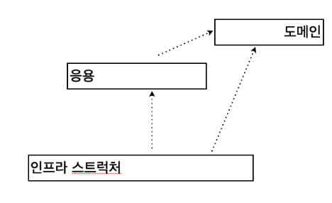

# **03.22.2023 Ch.02**
## **2.1 네개의 영역** 
아키텍처를 설계할때 사용하는 4개의 영역에 대한 개괄적인 설명 

1. 표현: 사용자의 요청을 받아 응용 영역에 전달하고 , 응용 영역의 처리 결과를 사용자에게 보여줌. ex:  UI 
1. 응용: 표현 영역을 통해 사용자의 요청을 전달받는 영역. 도메인 영역의 도메인 사용하고 로직을 직접 수행하기 보단 도메인 모델에 로직 수행을 위임 ex: Service 
1. 도메인: 도메인 모델을 구현. 도메인의 핵심 로직을 구현  
1. 인프라 스트럭처: 구현 기술. 실제 구현을 다룸. ex: DB 연동, SMTP 메일

도메인 영역, 응용 영역, 표현 영역은 구현기술을 사용한 코드를 직접 만들지 않음. 
## **2.2 계층 구조 아키텍처** 

아키텍처 네 영역을 구성할때 많이 사용하는 계층 구조이다. 

계층구조는 특성상 상위 계층에서 하위 계층으로의 의존만 존재하고 하위 계층은 상위 계층에 의존하지 않는다. (엄격한 버젼) 

하지만 구현하다보면 계층 구조를 유연하게 적용하기도 함. 위의 그림의 경우 응용계층이 인프라 스트럭쳐 모듈에 의존하게됨. 

이렇게 표현, 응용, 도메인 (고수준 모듈) 계층이 상세한 구현(저수준 모듈) 기술을 다루는 인프라 스트럭처 계층에 종속되는 문제 발생 

그러면 두가지 문제가 발생함

1. 한 계층만 테스트가 어려움. 저수준 객체 실행을 위한 설정이 다 되어야 동작함 
1. 구현 방식을 변경하기 어려워 기능 확장이 어려움 

질문

위와 같이 특정 구현 모듈에 종속되서 개발에 어려움을 겪은적이 있으신가요? 
## **2.3 DIP** 
고수준 모듈 : 의미있는 단일 기능. 여러 하위 기능을 가짐 ex: 표현, 응용, 도메인

저수준 모듈 : 하위 기능을 실제로 구현한 것 ex: 인프라 스트럭처

의존성 역전 원칙 (DIP)를 통해 저수준 모듈이 고수준 모듈에 의존하도록 변경. 

` `HOW? → 추상화한 Interface를 이용하자! 

두가지 문제 해결

1. 구현 방식을 변경하기 어려워 기능 확장이 어려움 

저수준 모듈에서 구현해야할게 있다면 일단 인터페이스로 추상화 해놓고 실제 구현은 인터페이스를 상속받아 구현. 고수준 모듈에서는 구현 객체를 생성자로 전달 받아 처리 

이러면 구현 기술을 변경하더라도 전달할 구현 객체만 바꿔서 생성자로 주입 시키면 된다 

1. 한 계층만 테스트가 어려움

인터페이스 이므로 대역 객체 (mock 데이터)로 대체하여 테스트도 가능 
### **2.3.1 DIP 주의사항** 
의존성 역전 원칙의 핵심은 고수준 모듈이 저수준 모듈에 의존하지 않도록 하기 위함.

저수준 모듈에서 인터페이스를 추출하는 하지 않도록 함. 

하위 기능을 추상화한 인터페이스는 고수준 모듈 관점에서 도출. 
### **2.3.1 DIP와 아키텍처** 

DIP를 적용하면 응용 영역과 도메인 영역에 영향을 최소화 하면서 구현체를 변경하거나 추가 가능 

BUT 항상 DIP 적용할 필요는 없다. 케바케로 적용하자 

Q OOP 관점에선 어쩔수 없이 빌드업 형식으로 고모듈이 저모듈에 의존하게 되는데 DIP가 맞을까? 

Q 추상화 고모듈이 추상화 하기 어렵지 않을까? 

`   `추상화는 어려워.. 

## **2.4 도메인 영역의 주요 구성 요소**  
엔티티: 고유의 식별자를 가지는 객체. 라이프 사이클 가짐. 도메인의 고유한 개념 표현. 도메인 모델의 데이터를 포함하고 데이터와 관련된 기능 제공 

밸류: 고유의 식별자 가지지 않음. 개념적인 하나의 값 사용. 다른 밸류 타입의 속성으로 사용 가능. 불변으로 구현 권장 

애그리거트: 엔티티와 밸류를 개념적으로 하나로 묶음

리포지터리 : 도메인 모델 영속성 처리. 데이터 저장, 로딩 

도메인 서비스 : 특정 엔티티에 속하지 않은 도메인 로직 제공.

Q 리포지터리 바라보는 관점

스프링의 서비스와 다른 관점일까?  
## **2.5 요청 처리 흐름** 
표현영역을 통해 사용자의 요청을 받고 응용 서비스에 기능 실행 위임

응용 서비스는 도메인 모델을 이용해 기능 구현

기능 구현이 필요한 도메인 객체를 리포지터리에서 가져오거나 저장. (트랜잭션 관리..)
## **2.6 인프라 스트럭처 개요** 
다른 영역에서 필요로하는 프레임워크, 구현기술, 보조기능 지원 

구현의 편리함과 DIP의 장점을 잘 생각해서 유연하게 개발. 

표현 영역은 인프라 스트럭처와 연관이 깊다. ex: 스프링 프레임 워크.. 
## **2.7 모듈 구성** 
도메인이 크면 하위 도메인 별로 모듈을 나눈다. 

애거리거트를 기준으로 패키지를 구성하자. 애그리거트, 모델, 리포지터리는 같은 패키지에 위치 시킴

가능한 패키지당 15개 미만으로 타입 개수를 유지..  

**Q 패키징 나누는 기준 :** 

도연님 : 데이터 기준으로 패키징을 나누었다. 맡아야할 책임 기준이 원칙인것 알지만... 

미소님: 컨트롤러 기준으로 많이 나눈다. VO는 테이블의 종속성에 따라 나눈 경우도 많았다. 

고보형: 화면의 카테고리 단위. → 화면단위.. 

솔님: 기능단위. 지향하는 방향은 도메인 단위로 묶어서 멀티 컴포넌트로 간다. 

**Q 왜 토이프로젝트에서만 도메인 단위 패키징이 가능할까? 실무 프로젝트에선 왜 힘들까?** 

솔님: 요구사항이 갑자기 밀려와서 그 역할이 그 역할이 아니게 됨.

미소님: 큰그림을 봐야하는데 자기 영역이 강한 개발자는 그 관점을 보기 어려워서 그렇지 않을까? 

도연님: 계속해서 변화하는 프로젝트와 짧은 개발 기간 일정 때문에 관점을 유지하기 어려움. 납기 기한이 더 중요하기 때문에! 개발 기간을 넉넉하게 주세용.

보형: 요구 사항이 픽스가 사전에 안되서 그런게 아닐까? 

