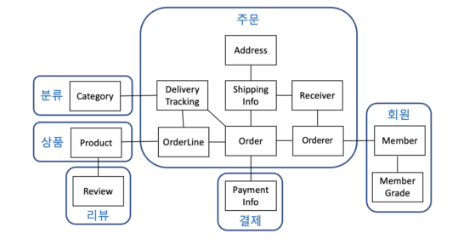
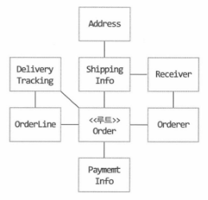
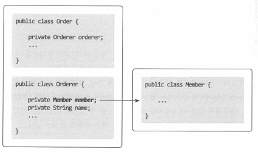

# **03.26.2023 Ch.03**
## **3.1 애그리거트**
**: 상위 수준에서 도메인 모델 간의 관계를 쉽게 파악**

도메인 객체 모델이 복잡해지면 개별 구성요소 위주로 모델을 이해하게 되고 전반적인 구조나 큰 수준에서 도메인 간의 관계를 파악하기 어려워짐
→ 주요 도메인 요소 간 파악이 어렵다 => 코드의 변경 어려움, 확장 어려움

=> 복잡한 도메인을 이해하기 관리하기 쉬운 단위로 만들기 위해 상위 수준에서 모델을 조망할 수 있도록 하는 방법

1. 도메인 모델 이해를 도움
1. 일관성을 관리하는 기준이 됨
   → 복잡도가 낮아지고 개발 시간 단축

특징

- 관련된 모델을 하나로 모았기 때문에 한 애그리거트에 속한 객체는 유사하거나 동일한 라이프 사이클을 가짐 (최초 생성시는 일부 객체를 만들 필요가 없기도 하지만 애그리거트에 속한 구성요소는 대부분 함께 생성하고 함께 제거됨)
- **한 애그리거트에 속한 객체는 다른 애그리거트에 속하지 않음 (각 애그리거트는 자기 자신만을 관리)**

애그리거트 결정 규칙

- 도메인 규칙과 요구 사항 
  - 도메인 규칙에 따라 함께 생성되는 구성요소 → 한 애그리거트에 속할 가능성 높음
  - 요구사항에 따라 함께 변경되는 빈도가 높은 객체 →  한 애그리거트에 속할 가능성 높음

질문

` `product - review도 라이프사이클을 비슷하게 가져가야하지 않을까?

도연님 : 리뷰가 있기 위해서는 제품이 필수적으로 있어야한다고 생각 (데이터 중심)

솔님 : 리뷰는 제품의 리뷰만 있는 건 아니니 독립적일 수 있다고 생각 (서비스 중심)

미소님 : 의도에 따라 다르므로 설계를 잘 고려해야한다고 생각
## **3.2 애그리거트 루트**
애그리거트 : 여러 객체로 구성
\> 도메인 규칙을 지키기 위해 애그리거트에 속한 모든 객체가 정상 상태를 가져야한다. (일관성)

\> 애그리거트 전체를 관리할 주체 : **애그리거트의 루트 엔티티 (=대표 엔티티)**

역할

- 애그리거트의 일관성이 깨지지 않도록 하는 것 
  - 구성 요소의 상태 변경 위임 -  해당 루트 엔티티에서 하위 엔티티의 속성을 바꾸도록 관리 
    - 단순히 필드를 변경하는 set 메서드를 공개 범위로 만들지 않음
    - 밸류 타입은 불변으로 구현
  - 기능 실행 위임 - 하위 여러개의 엔티티의 상태를 공통으로 관리해야할 경우, 루트 애그리거트에서 상태 변경 위임

- 애그리거트 루트가 도메인 규칙을 올바르게만 구현하면 애그리거트 전체의 일관성을 올바르게 유지 가능

**질문**

- **팀 내의 여러 코드들에서 공개 set 메서드 사용 이미 많이 사용되고 있는 것 같은데, 공개 set 메서드 사용에 대해 어떻게 생각하는지?** 

도연님 : 공학적으로는 반대(트래킹이 어려움). 어디서든 데이터를 쉽게 바꿀 수 있다는건 좋지 않은 설계. 코더의 입장에서는 아키텍쳐부터 리팩터링을 해야하는데 범위가 너무 큼. 그렇기 때문에 규모가 큰 현업에서는 많이 사용하고 있는 듯 함. 어쩔 수 없다

미소님 : 실무단에서는 데이터를 넣기위해서 사용할 수 밖에 없게 되는 것 같음. 설계 자체는 좋다고 생각하지 않음

솔님 : setter가 많아질때 서비스의 순수한 로직이 보이지도 않은 경우가 있음. 빌더나 생성자 사용도 고려해보아야한다고 생각

트랜젝션

- 트랜잭션의 범위는 작을수록 좋음 (DB Lock의 대상이 많아짐 → 처리량 감소)
- 한 트랜잭션에서는 한 개의 애그리거트만 수정 (충돌 가능성도 있음) 
  - **→ 한 애그리거트에서 다른 애그리거트를 수정하지 않아야함 (최대한 서로 독립적)**

불가피한 상황에서는 응용 서비스에서 애그리거트 수정
## **3.3 리포지터리와 애그리거트**
애그리거트 - 개념상 완전한 한 개의 도메인 모델 표현

→ 한 개의 리포지터리는 애그리거트 단위로 존재

어떤 기술을 이용해서 리포지터리를 구현하느냐에 따라 애그리거트의 구현도 영향을 받음

RDBMS - 리포지터리를 구현하면 트랜젝션을 이용해서 애그리거트의 변경이 저장소에 반영되는 것을 보장

몽고DB(NOSQL) - 한 개 애그리거트를 한 개 문서에 저장 → 한 애그리거트의 변경을 손실 없이 반영 

**질문**

도메인 == 엔티티 모델에 대해 어떻게 생각하는지

이미 만들어진 DB에서 우리가 원했던 애그리거트의 형태를 제대로 따라갈 수 있을지?

미소님 : DB팀과의 협력이 중요할 것 같음. 

도연님 :  우리팀만이 아닌 다른 서비스에서도 DB가 존재하므로 원하는 대로 관리를 하기 위해서는 DB를 새로 생성해야할  것임

솔님 : 이미 만들어진 서비스에서 DDD를 도입하기 가장 어렵다고 생각하는 부분임
## **3.4 ID를 이용한 애그리거트 참조**
다른 애그리처드 참조시, 루트 to 루트로 참조

1. 필드를 이용한 애그리거트 참조 
   1. 문제점 
      1. 편한 탐색 오용
      1. 성능 이슈
      1. 확장 어려움
1. ID 참조  
   1. 모든 객체가 참조로 연결되지 않고 한 애그리거트에 속한 객체들만 참조로 연결
   1. 애그리거트의 경계를 명확히 하고 애그리거트 간 물리적 연결을 제거 → 모델의 복잡도 감소, 응집도 상승
   1. 문제점 
      1. 참조하는 여러 애그리거트를 읽을 때 조회 속도 느림 (N+1 문제 발생)
         → 다시 객체 참조 방식으로 바꾸고 즉시 로딩 사용
         → 조회 전용 쿼리 사용 (별도의 DAO 생성 → JPQL로 raw query 생성)

**질문**

**필드 참조 vs id참조**

도연님 : id 참조를 잘못하게 되면 사이클이 생기게 되어 문제가 생길 수 있음. 조심스럽게 가져가야한다고 생각. 확장의 어려움은 두 참조에서 모두 발생할 것 임. 경계를 명확하게 가져가는건 이점

미소님 : 개발자 입장에서는 속도가 느린건 DB 측면에서 해결이 가능할 것임. 룰을 정해서 필드 참조가 더 나을 것 같음

솔님 :  id 참조가 더 나을 것 같음. 객체를 참조하게 되면 테이블간의 fk로 묶어버리면 생성과 삭제가 어렵게 되므로 확장성이 어렵다고 생각하고, DB 종속적이 된다고 생각
## **3.5 애그리거트 간 집합 연관**
1-N 연관 관계시, 요구사항 충족 != 실제 구현 반영일 때가 있음

product - category 
→ 개념적으로는 카테고리가 제품을 가지고 있는 것이 맞지만, 제품의 개수는 월등히 많기 때문에 성능적인 이슈로 제품에 카테고리를 참조하는 방식을 고려해볼 수 있음

**요구사항에서 어떤 구현이 필요할지 고민해보고 필수적인 연관 구현하기**
## **3.6 애그리거트를 팩토리로 사용하기**
응용 서비스에 도메인 로직이 노출되는 것을 방지 → 한 애그리거트의 내부 메서드로 다른 애그리거트를 생성 또는 생성 위임(팩토리 패턴 구현)

→ 도메인의 응집도를 높이면셔, 중요한 도메인 로직을 함께 구현할 수 있음

