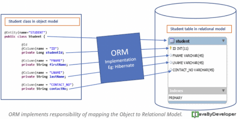
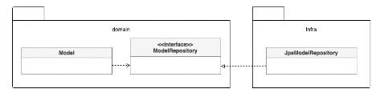

# **04.05.2023 Ch.04**
## **4.1 JPA를 이용한 리포지터리 구현**
도메인 모델과 리포지터리를 구현할 때 선호 하는 기술: JPA
→ RDBMS를 사용할 때, 객체 기반의 도메인 모델과 관계형 데이터 모델 간의 매핑을 처리하는 기술로 ORM(Object Relational Mapping, 객체 관계 매핑) 만한 것이 없다.

모듈 위치: **리포지터리 인터페이스**는 애그리거트와 같이 **도메인 영역**에 속하고, **리포지터리를 구현한 클래스**는 **인프라스트럭터 영역**에 속한다. 이는 리포지터리 구현 클래스를 인프라스트럭처 영역에 위치시켜서 인프라스트럭처에 대한 의존을 낮춰야 한다.

우리 팀도 vo를 중요하게 생각하기 때문에 나름 지켜지고 있다고 생각한다.

**리포지터리 인터페이스**

public interface OrderRepository {

`    `public Order findById(OrderNo no); // id로 Order 엔티티 조회

`    `public void save(Order order);

}

인터페이스는 애그리거트 **루트(Order)**를 기준으로 작성한다.  

애그리거트를 조회하는 기능의 이름을 지을 때, 널리 사용되는 규칙은 'findBy프로퍼티이름(프로퍼티 값)'형식을 사용하는 것이다.

findById()는 ID에 해당하는 애그리거트가 존재하면 Order를 리턴하고 존재하지 않으면 Null을 리턴한다. null을 사용하고 싶지 않다면 다음과 같이 Optional을 사용해도 된다.

**Optional**

Optional<Order> findById(OrderNo no);

Q. Optional을 사용하는 경우가 더 많을까? 아니면 사용하지 않을 경우가 더 많을까? 장단점 비교해서 생각해보는 것도 좋아요!

요즘은 다 optional 사용하고 있는 걸로 알고 있다. optional을 사용하는게 더 좋은 것 같다. api를 받아서 앱의 로직을 처리하다가 null이 떨어질 경우 앱이 종료 되는 경우도 있다. 

백엔드의 경우 optional은 필수가 아니다. 널포인터이셉션의 경우도 있어서, 리턴할 때 널인가 아닌가 확인하여 사용하면 좋을 것 같다.

**리포지터리를 구현한 클래스**

package com.myshop.order.infra.repository;

import com.myshop.order.command.domain.Order;

import com.myshop.order.command.domain.OrderNo;

import com.myshop.order.command.domain.OrderRepository;

import org.springframework.stereotype.Repository;

import javax.persistence.EntityManager;

import javax.persistence.PersistenceContext;

@Repository

public class JpaOrderRepository implements OrderRepository {

`    `@PersistenceContext

`    `private EntityManager entityManager;

`		`// entityManager의 find 메서드를 이용해 aggregate를 검색한다.

`    `@Override

`    `public Order findById(OrderNo id) {

`        `return entityManager.find(Order.class, id);

`    `}

`		`// entityManager의 persist 메서드를 이용해 aggregate를 저장한다.

`    `@Override

`    `public void save(Order order) {

`        `entityManager.persist(order);

`    `}

}

JPA entityManager 역할: <https://sweets1327.tistory.com/60>

실무에서는 Spring Data JPA가 알아서 리포지터리 구현 객체를 만들어주기 때문에 위에 소스코드를 직접 작성할 필요가 없다.

JPA vs Spring Data JPA: <https://velog.io/@evelyn82ny/JPA-vs-Spring-Data-JPA>

**ChangeOrderService.class**

public class ChangeOrderService {

`    `@Transactional

`    `public void changeShippingInfo(OrderNo no, ShippingInfo newShippingInfo) {

`        `Order order = orderRepository.findById(no);

`        `if (order == null) throw new OrderNotFoundException();

`        `order.changeShippingInfo(newShippingInfo);

`    `}

...

}

애그리거트를 수정한 결과를 저장소에 반영하는 메서드를 추가할 필요는 없다. JPA를 사용하면 트랜잭션 범위에서 변경한 데이터를 자동으로 DB에 반영하기 때문이다.

**JPQL 사용 예시**

@Override

public List<Order> findByOrdererId(String ordererId, int startRow, int fetchSize) {

`    `TypedQuery<Order> query = entityManager.createQuery(

`            `"select o from Order o " +

`                    `"where o.orderer.memberId.id = :ordererId " +

`                    `JpaQueryUtils.toJPQLOrderBy("o", "number.number desc"),

`            `Order.class);

`    `query.setParameter("ordererId", ordererId);

`    `query.setFirstResult(startRow);

`    `query.setMaxResults(fetchSize);

`    `return query.getResultList();

}

...

public static String toJPQLOrderBy(String alias, String... orders) {

`    `if (orders == null || orders.length == 0) return "";

`    `String orderParts = Arrays.stream(orders)

.map(order -> alias + "." + order)

.collect(joining(", "));

`    `return "order by " + orderParts;

}

ID 외에 다른 조건으로 애그리거트를 조회할 때에는 JPA의  Criteria나 JPQL을 사용할 수 있다.

**JPA를 활용한 삭제 기능**

@Override

public void remove(Order order) {

`    `entityManager.remove(order);

}

애그리거트 삭제기능은 EntityManager의 remove() 메서드를 이용하여 삭제 기능을 구현한다.

Q. 우리 회사에서 Rest API Delete 메서드는 감사 대상이다. 이 책에서도 데이터를 삭제하는 경우는 많지 않다고 되어 있으며 flag를 활용한다고 설명되어 있다. 여러분의 생각은?

flag 오남용인 경우가 있다. 좋아요했다가 싫어요 이런식으로 비효율적. where문을 계속 사용해야 해서 불편하다고 생각한다.

혹시나 잘못 삭제한 경우 안전장치로 flag를 이용하는게 맞다고 생각한다. 

왜 삭제했는지에 대한 history. 
## **4.2 스프링 데이터 JPA를 이용한 리포지터리 구현**
p.137

여기서는 그냥 사용하면 되는거라 딱히 설명할 내용이 없다. 자세한건 5장에서..
## **4.3 매핑 구현**
### **엔티티와 밸류 기본 매핑 구현**
애그리거트와 JPA 매핑을 위한 기본 규칙은 다음과 같다.

- 애그리거트 루트는 엔티티이므로 @Entity로 매핑 설정한다.
- 한 테이블에 엔티티와 밸류 데이터가 같이 있다면,
  - 밸류는 @Embeddable로 매핑 설정한다.
  - 밸류 타입 프로퍼티는 @Embedded로 매핑 설정한다.

p.140 비교해보기 
### **기본생성자**
밸류 타입의 경우 불변이므로 생성 시점에 필요한 값을 모두 전달받으므로 값을 변경하는 set 메서드는 제공하지 않는다. 하지만 JPA의 @Entity와 @Embeddable로 클래스를 매핑하려면 기본 생성자를 제공해야 한다. 하이버네이트와 같은 JPA 프로바이더는 DB에서 데이터를 읽어와 매핑된 객체를 생성할 때 기본 생성자를 사용해서 객체를 생성한다. 이런 이유로 다른 코드에서 기본 생성자를 사용하지 못하도록 protected로 선언한다.
### **필드 접근 방식 사용**
set 메서드는 내부 데이터를 외부에서 변경할 수 있는 수단이 되기 때문에 캡슐화를 깨는 원인이 될 수 있다. 엔티티가 객체로서 제 역활을 하려면 외부에 set 메서드 대신 의도가 잘 드러나는 기능을 제공해야 한다.
엔티티를 객체가 제공할 기능 중심으로 구현하도록 유도하려면 JPA 매핑 처리를 프로퍼티 방식이 아닌 필드 방식으로 선택해서 불필요한 get/set 메서드를 구현하지 말아야 한다.
### **AttributeConverter를 이용한 밸류 매핑 처리**
구현방식에 따라 밸류 타입의 프로퍼티를 한 개 칼럼에 매핑해야 할 때도 있다. 예를 들어 Length가 길이 값과 단위의 두 프로퍼티를 갖고 있는데 DB 테이블에는 한 개 칼럼에 '1000mm'와 같은 형식으로 저장할 수 있다.

두 개 프로퍼티를 한 개 칼럼에 매핑해야 할 때
JPA 2.0 버전에서는 이를 처리하기 위해 다음과 같이 칼럼과 매핑하기 위한 프로퍼티를 따로 추가하고 get/set 메서드에서 실제 밸류 타입과 변환 처리를 해야 했다.

p.146 참고하기
### **밸류 컬렉션: 별도 테이블 매핑**
밸류 컬렉션을 별도 테이블로 매핑할 때는 @ElementCollection과 @CollectionTable을 함께 사용한다.

p.148 참고하기
### **밸류 컬렉션: 한 개 칼럼 매핑**
밸류 컬렉션을 별도 테이블이 아닌 한 개 칼럼에 저장해야 할 때가 있다. 예를 들어, 도메인 모델에는 이메일 주소 목록을 Set으로 보관하고 DB에는 한 개 컬럼에 콤마로 구분해서 저장해야 할 때가 있다. 이때 AttributeConverter를 사용하면 밸류 컬렉션을 한 개 칼럼에 쉽게 매핑할 수 있다. 단, AttributeConverter를 사용하려면 밸류 컬렉션을 표현하는 새로운 밸류 타입을 추가해야 한다.

p.150 참고하기
### **밸류를 이용한 아이디 매핑**
식별자는 보통 문자열이나 숫자와 같은 기본 타입을 사용한다. 이 방법도 나쁘지 않지만 식별자라는 의미를 부각시키기 위해 식별자 자체를 별도 밸류 타입으로 만들 수도 있다. 이때 @Id 대신 @EmbeddedId 애노테이션을 사용한다. (JPA 에서 식별자 타입은 Serializable 타입이어야 하므로 식별자로 사용될 밸류 타입은 Serializable 인터페이스를 상속받아야 한다)
밸류 타입으로 식별자를 구현할 때 얻을 수 있는 장점은 식별자에 기능을 추가할 수 있다는 점이다. 예를 들어, 1세대 시스템의 주문번호와 2세대 시스템의 주문번호를 구분할 때 주문번호의 첫 글자를 이용한다고 해보자.

p.152 참고하기
### **별도 테이블에 저장하는 밸류 매핑**
애그리거트에서 루트 엔티티를 뺀 나머지 구성요소는 대부분 밸류이다. 만약 밸류가 아니라 엔티티가 확실하다면 다른 애그리거트는 아닌지 확인해야 한다. 특히, 자신만의 독자적인 라이프사이클을 갖는다면 다른 애그리거트일 가능성이 높다.

ArticleContent는 밸류이므로 @Embeddable로 매핑한다. ArticleContent와 매핑되는 테이블은 Article과 매핑되는 테이블과 다른데, 이때 밸류를 매핑한 테이블을 지정하기 위해 @SecondaryTable과 @AttributeOverride를 사용한다.

@SecondaryTable을 이용하면 아래 코드를 실행할 때 두 테이블을 조인해서 데이터를 조회한다.

한 가지 단점은 @SecondaryTable을 사용하면 목록 화면에 보여줄 Article을 조회할 때 artivle\_content 테이블까지 조인해서 데이터를 읽어오는데 이는 원하는 결과가 아니다. 이는 5장에서 조회 전용 쿼리를 실행하여 해결할 수 있다.
### **밸류 컬렉션을 @Entity로 매핑하기**
개념적으로 밸류인데 구현 기술의 한계나 팀 표준 때문에 @Entity를 사용해야 할 때도 있다. JPA는 @Embeddable 타입의 클래스 상속 매핑을 지원하지 않는다. 대신 @Entity를 이용한 상속 매핑으로 처리해야 한다. 엔티티로 관리되므로 식별자 필드가 필요하고 타입 식별 칼럼을 추가해야 한다.
### **ID 참조와 조인 테이블을 이용한 단방향 M:N 매핑**
집합의 값에 밸류 대신 연관을 맺는 식별자가 온다
@ElementCollection을 이용하기 때문에 Product를 삭제할 때 매핑에 사용한 조인 테이블의 데이터도 함께 삭제된다.

Q. 매핑 구현 방법에 대해 굉장히 많이 나왔는데 여러분의 생각은?
## **4.4 애그리거트 로딩 전략**
애그리거트는 개념적으로 하나여야 한다. 하지만, 루트 엔티티를 로딩하는 시점에 애그리거트에 속한 객체를 모두 로딩해야 하는 것은 아니다. 그 이유는 다음의 두 가지이다.

- 상태를 변경하는 기능을 실행할 때 애그리거트 상태가 완전해야 한다
- 표현 영역에서 애그리거트의 상태 정보를 보여줄 때 필요하다

JPA는 트랜잭션 범위 내에서 지연 로딩을 허용하기 때문에 다음 코드처럼 실제로 상태를 변경하는 시점에 필요한 구성요소만 로딩해도 문제가 되지 않는다.

일반적으로 상태를 변경하기 보다는 조회하는 빈도 수가 높다. 이런 이유로 애그리거트 내의 모든 연관을 즉시 로딩으로 설정할 필요는 없다. 물론, 지연 로딩은 즉시 로딩보다 쿼리 실행 횟수가 많아질 가능성이 더 높다. 따라서, 무조건 즉시 로딩이나 지연 로딩으로만 설정하기보다는 애그리거트에 맞게 즉시 로딩과 지연 로딩을 선택해야 한다.
## **4.5 애그리거트의 영속성 전파**
애그리거트는 완전한 상태여야 한다는 것은 **조회할 때뿐만 아니라 저장하고 삭제할 때도 필요**하다

- 저장 메서드는 애그리거트 루트만 저장하면 안 되고 애그리거트에 속한 모든 객체를 저장해야 한다
- 삭제 메서드는 애그리거트 루트뿐만 아니라 애그리거트에 속한 모든 객체를 삭제 해야 한다.

@Embeddable 매핑 타입의 경우 함께 저장되고 삭제되므로 cascade 속성을 추가로 설정하지 않아도 된다. 반면에 애그리거트에 속한 @Entity 타입에 대한 매핑은 cascade 속성을 사용해서 저장과 삭제 시에 함께 처리되도록 설정해야 한다.

@OneToOne, @OneToMany는 cascade 속성의 기본값이 없으므로 cascade 속성값으로 CascadeType.PERSIST, CascadeType.REMOVE를 설정한다.
## **4.6 식별자 생성기능**
식별자는 크게 세가지 방식 중 하나로 생성

- 사용자가 직접 생성
- 도메인 로직으로 생성
- DB를 이용한 일련번호 사용

p.167 참고

Q. 여러분이라면 어떤 방식을 선호하시는지?
## **4.7 도메인 구현과 DIP**
여기서는 DIP (Dependency Inversion Principle) 원칙을 어기고 있다. 

p.170 참고

ArticleRepository 인터페이스는 도메인 패키지에 위치하는데 JPA의 Repository 인터페이스를 상속하고 있다. 즉 도메인이 인프라에 의존하는 경우.

